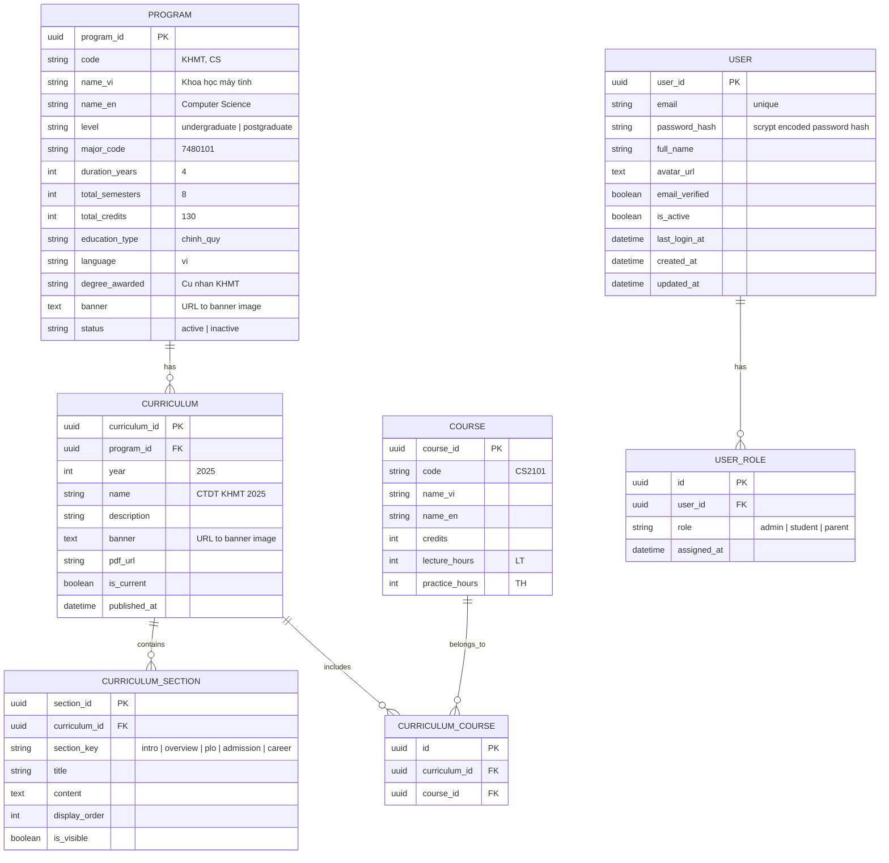

# DATABASE DESIGN FOR SIT

## Core Entities

### Curriculum Management

1. **PROGRAM** – Ngành / chương trình đào tạo (KHMT, AI, DS…)
2. **CURRICULUM** – CTĐT theo năm (CTĐT 2025)
3. **CURRICULUM_SECTION** – Các mục hiển thị dạng accordion trên website
4. **COURSE** – Học phần chuẩn (CS2101, CS2102…)
5. **CURRICULUM_COURSE** – Bảng nối CTĐT và học phần

### Authentication & Authorization

6. **USER** – Tài khoản người dùng đăng nhập bằng email/password
7. **USER_ROLE** – Vai trò của người dùng (admin, student, parent)

---

## 3. ERD (Mermaid)



---

## 4. Entity detail & purpose

### 4.1 PROGRAM

**Mục đích**: Lưu thông tin chung của ngành đào tạo.

Map trực tiếp với phần **THÔNG TIN CHUNG** trên website CTĐT.

| Field           | Ý nghĩa                     |
| --------------- | --------------------------- |
| code            | Mã ngành hiển thị / routing |
| level           | Đại học / Sau đại học       |
| major_code      | Mã ngành theo Bộ            |
| duration_years  | Thời gian đào tạo           |
| total_semesters | Tổng số học kỳ              |
| total_credits   | Tổng số tín chỉ             |
| education_type  | Chính quy                   |
| language        | Ngôn ngữ giảng dạy          |
| degree_awarded  | Văn bằng tốt nghiệp         |

---

### 4.2 CURRICULUM

**Mục đích**: Đại diện cho một CTĐT cụ thể theo năm.

- Một PROGRAM có thể có nhiều CURRICULUM.
- Website thường chỉ hiển thị `is_current = true`.
- `pdf_url` dùng để tải file CTĐT gốc.

---

### 4.3 CURRICULUM_SECTION

**Mục đích**: Lưu nội dung hiển thị chi tiết của CTĐT.

> Mỗi accordion trên website = **1 row** trong bảng này.

| section_key             | Ví dụ                 |
| ----------------------- | --------------------- |
| intro                   | Giới thiệu CTĐT       |
| overview                | Thông tin CTĐT        |
| vision                  | Sứ mạng – Tầm nhìn    |
| objectives              | Mục tiêu CTĐT         |
| learning_outcomes       | Chuẩn đầu ra (PLO)    |
| admission_requirements  | Chuẩn đầu vào         |
| workload                | Khối lượng học tập    |
| curriculum_structure    | Cấu trúc CTĐT         |
| teaching_method         | Phương pháp giảng dạy |
| assessment              | Phương pháp đánh giá  |
| career_opportunities    | Vị trí việc làm       |
| graduation_requirements | Điều kiện tốt nghiệp  |

`content` lưu **HTML hoặc Markdown**.

---

### 4.4 COURSE

**Mục đích**: Định nghĩa học phần chuẩn.

> Lưu thông tin chung của một học phần, **không** gắn với CTĐT cụ thể nào.

| Field          | Ý nghĩa               |
| -------------- | --------------------- |
| code           | Mã học phần (CS2101)  |
| name_vi        | Tên tiếng Việt        |
| name_en        | Tên tiếng Anh         |
| credits        | Số tín chỉ            |
| lecture_hours  | Số giờ lý thuyết (LT) |
| practice_hours | Số giờ thực hành (TH) |

**Ví dụ**:

- CS2101 – Cấu trúc dữ liệu và giải thuật
- 3 tín chỉ
- 2 LT – 1 TH

---

### 4.5 CURRICULUM_COURSE

**Mục đích**: Bảng nối giữa CTĐT và học phần.

> Trả lời câu hỏi: **CTĐT 2025 KHMT có những môn học nào?**

Dùng để render bảng **"Cấu trúc và nội dung CTĐT"** trên website.

| Field         | Ý nghĩa           |
| ------------- | ----------------- |
| curriculum_id | FK tới CURRICULUM |
| course_id     | FK tới COURSE     |

---

### 4.6 USER

**Mục đích**: Lưu thông tin tài khoản và thông tin xác thực email/mật khẩu cục bộ.

| Field          | Ý nghĩa                                    |
| -------------- | ------------------------------------------ |
| email          | Email đăng nhập (unique)                   |
| password_hash  | Chuỗi hash mật khẩu được tạo bằng scrypt    |
| full_name      | Họ và tên đầy đủ                           |
| avatar_url     | URL ảnh đại diện                           |
| email_verified | Email đã xác thực chưa                     |
| is_active      | Tài khoản có hoạt động không               |
| last_login_at  | Thời gian đăng nhập gần nhất               |

**Ví dụ**: Email/password user có `email = "student@sit.edu.vn"`; hệ thống chỉ lưu hash scrypt, không lưu mật khẩu gốc.

---

### 4.7 USER_ROLE

**Mục đích**: Quản lý vai trò của người dùng theo RBAC.

> Một USER có thể có **nhiều vai trò**. Ví dụ: một sinh viên cũng có thể là phụ huynh.

| Field       | Ý nghĩa                         |
| ----------- | ------------------------------- |
| user_id     | FK tới USER                     |
| role        | Vai trò: admin, student, parent |
| assigned_at | Thời gian gán vai trò           |

**3 vai trò mặc định**:

- `admin` – Quản trị viên hệ thống
- `student` – Sinh viên
- `parent` – Phụ huynh

**Ví dụ**:

- User A có 1 role: `student`
- User B có 2 roles: `student` và `parent`
- User C có 1 role: `admin`

---

## 5. Drizzle ORM schema (TypeScript)

> Compatible với PostgreSQL

```ts
import {
  pgTable,
  uuid,
  varchar,
  integer,
  boolean,
  text,
  timestamp,
} from 'drizzle-orm/pg-core';

export const program = pgTable('program', {
  programId: uuid('program_id').primaryKey().defaultRandom(),
  code: varchar('code', { length: 50 }).notNull(),
  nameVi: varchar('name_vi', { length: 255 }).notNull(),
  nameEn: varchar('name_en', { length: 255 }),
  level: varchar('level', { length: 20 }).notNull(),
  majorCode: varchar('major_code', { length: 20 }),
  durationYears: integer('duration_years'),
  totalSemesters: integer('total_semesters'),
  totalCredits: integer('total_credits'),
  educationType: varchar('education_type', { length: 50 }),
  language: varchar('language', { length: 10 }),
  degreeAwarded: varchar('degree_awarded', { length: 255 }),
  banner: text('banner'),
  status: varchar('status', { length: 20 }).default('active'),
});

export const curriculum = pgTable('curriculum', {
  curriculumId: uuid('curriculum_id').primaryKey().defaultRandom(),
  programId: uuid('program_id')
    .references(() => program.programId)
    .notNull(),
  year: integer('year').notNull(),
  name: varchar('name', { length: 255 }).notNull(),
  description: text('description'),
  banner: text('banner'),
  pdfUrl: text('pdf_url'),
  isCurrent: boolean('is_current').default(false),
  publishedAt: timestamp('published_at', { withTimezone: true }).defaultNow(),
});

export const curriculumSection = pgTable('curriculum_section', {
  sectionId: uuid('section_id').primaryKey().defaultRandom(),
  curriculumId: uuid('curriculum_id')
    .references(() => curriculum.curriculumId)
    .notNull(),
  sectionKey: varchar('section_key', { length: 100 }).notNull(),
  title: varchar('title', { length: 255 }).notNull(),
  content: text('content'),
  displayOrder: integer('display_order'),
  isVisible: boolean('is_visible').default(true),
});

export const course = pgTable('course', {
  courseId: uuid('course_id').primaryKey().defaultRandom(),
  code: varchar('code', { length: 50 }).notNull(),
  nameVi: varchar('name_vi', { length: 255 }).notNull(),
  nameEn: varchar('name_en', { length: 255 }),
  credits: integer('credits').notNull(),
  lectureHours: integer('lecture_hours'), // LT
  practiceHours: integer('practice_hours'), // TH
});

export const curriculumCourse = pgTable('curriculum_course', {
  id: uuid('id').primaryKey().defaultRandom(),
  curriculumId: uuid('curriculum_id')
    .references(() => curriculum.curriculumId, { onDelete: 'cascade' })
    .notNull(),
  courseId: uuid('course_id')
    .references(() => course.courseId, { onDelete: 'cascade' })
    .notNull(),
});

export const user = pgTable('user', {
  userId: uuid('user_id').primaryKey().defaultRandom(),
  email: varchar('email', { length: 255 }).notNull().unique(),
  passwordHash: varchar('password_hash', { length: 255 }),
  fullName: varchar('full_name', { length: 255 }).notNull(),
  avatarUrl: text('avatar_url'),
  emailVerified: boolean('email_verified').default(false),
  isActive: boolean('is_active').default(true),
  lastLoginAt: timestamp('last_login_at', { withTimezone: true }),
  createdAt: timestamp('created_at', { withTimezone: true }).defaultNow(),
  updatedAt: timestamp('updated_at', { withTimezone: true }).defaultNow(),
});

export const userRole = pgTable('user_role', {
  id: uuid('id').primaryKey().defaultRandom(),
  userId: uuid('user_id')
    .references(() => user.userId, { onDelete: 'cascade' })
    .notNull(),
  role: varchar('role', { length: 20 }).notNull(), // 'admin' | 'student' | 'parent'
  assignedAt: timestamp('assigned_at', { withTimezone: true }).defaultNow(),
});
```

---

## 6. Query pattern cho website

### Load CTĐT hiện hành

```ts
const currentCurriculum = await db.query.curriculum.findFirst({
  where: (c, { eq }) => eq(c.isCurrent, true),
  with: {
    sections: {
      orderBy: (s, { asc }) => asc(s.displayOrder),
    },
  },
});
```

### Load danh sách học phần trong CTĐT

```ts
const courses = await db
  .select({
    courseId: course.courseId,
    code: course.code,
    nameVi: course.nameVi,
    nameEn: course.nameEn,
    credits: course.credits,
    lectureHours: course.lectureHours,
    practiceHours: course.practiceHours,
  })
  .from(curriculumCourse)
  .innerJoin(course, eq(curriculumCourse.courseId, course.courseId))
  .where(eq(curriculumCourse.curriculumId, curriculumId));
```
